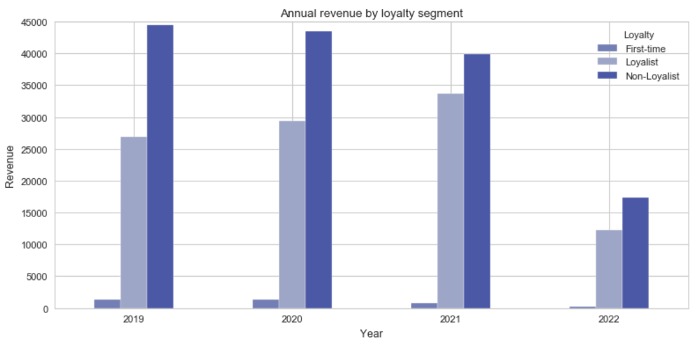
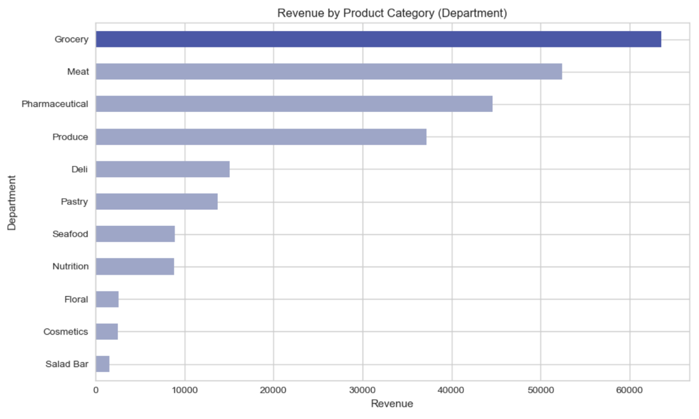
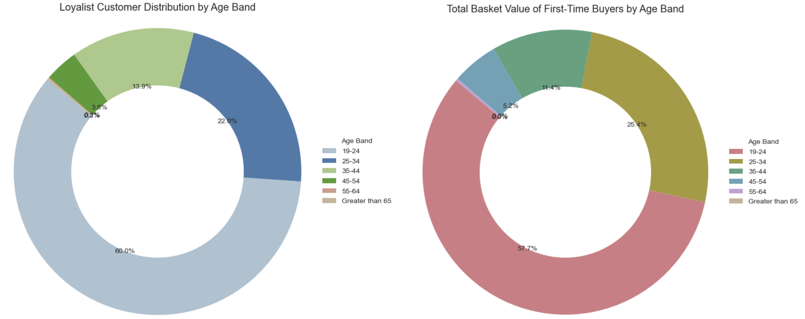
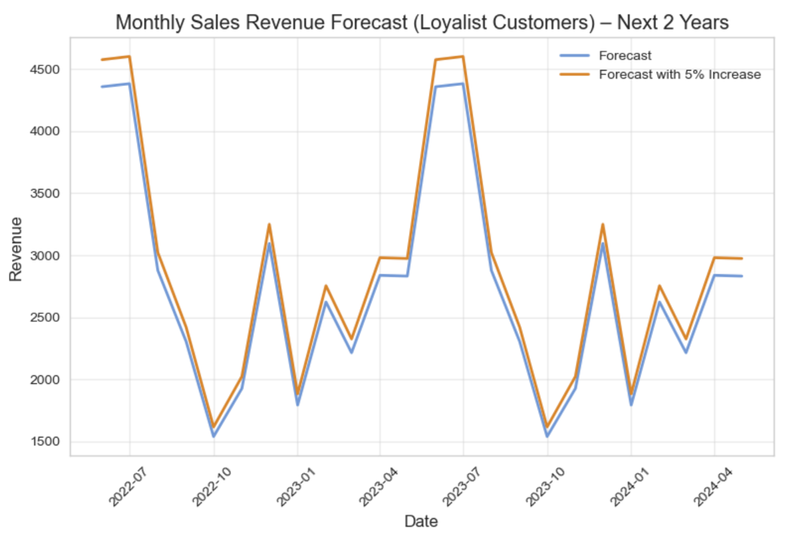

# 🛒 SuperFoodsMax Revenue Growth Analysis

### Customer Loyalty, Revenue Growth & Retail Analytics using Python

A Data Analytics portfolio project completed as part of the **RMIT Online Business Analytics with SQL & Python Program**.


---

# 📌 Project Snapshot

| Item | Details |
|--------|---------|
| Industry | Retail Analytics |
| Analysis Type | Customer Loyalty & Revenue Analysis |
| Dataset | Simulated Retail Transactions (2019–2022) |
| Tools | Python, Pandas, NumPy, Matplotlib, Seaborn |
| Business Goal | Achieve 5% Revenue Growth |
| Focus Areas | Loyalty, Revenue, Customer Behaviour, Forecasting |
| Outcome | Identified customer retention and revenue growth opportunities |

---

# 🚀 Executive Summary

This project investigates customer purchasing behaviour and revenue drivers using retail transaction data.

The analysis revealed that:

- Non-loyal customers currently generate the largest share of revenue.
- Loyal customers demonstrate stronger long-term growth potential.
- Customers aged 19–34 represent the highest-value customer segment.
- Grocery, Meat and Pharmaceutical categories generate the highest revenue contribution.
- A targeted retention strategy could realistically support a 5% revenue growth objective.

---

# 📊 Key Performance Indicators

| KPI | Description |
|------|------------|
| Revenue Analysis | Annual and Monthly Revenue Trends |
| Customer Segments | Loyal, Non-Loyal, First-Time Customers |
| Top Revenue Categories | Grocery, Meat, Pharmaceutical |
| Highest Value Age Group | 19–34 Years |
| Forecast Horizon | 2 Years |
| Growth Target | 5% Revenue Increase |

---

# 🖼️ Dashboard Gallery

## Customer Loyalty Analysis



**Insight:** Non-loyal customers currently contribute the highest revenue, while loyal customers demonstrate stronger long-term growth potential.

---

## Product Category Analysis



**Insight:** Grocery, Meat, and Pharmaceutical categories generate the largest share of revenue.

---

## Customer Demographics Analysis



**Insight:** Customers aged 19–34 represent the most valuable customer segment.

---

## Revenue Forecast Analysis



**Insight:** A 5% revenue increase is achievable through customer retention and category growth initiatives.

---

# 📑 Table of Contents

- Project Overview
- Why This Project Matters
- Business Problem
- Business Questions
- Dataset Information
- Project Structure
- Tools and Technologies
- Analytics Workflow
- Skills Demonstrated
- Data Cleaning and Preparation
- Data Visualisations
- Key Findings
- Business Impact
- Business Recommendations
- Future Improvements
- How to Run This Project
- Author
- ATS Keywords

---

# Project Overview

This project analyses customer loyalty, purchasing behaviour, product performance, and revenue trends using transactional retail data from 2019–2022.

The analysis focuses on:

- Customer loyalty and retention
- Customer spending behaviour
- Product category performance
- Revenue growth opportunities
- Customer segmentation
- Revenue forecasting

The goal is to support strategic decision-making using data-driven insights.

---

# Why This Project Matters

With over 9 years of experience in Software Testing and Quality Assurance, this project demonstrates the application of analytical thinking, business problem solving, data exploration, and data visualisation techniques to support business decision-making.

### Transferable Skills Demonstrated

- Data Validation
- Root Cause Analysis
- Trend Identification
- Business Reporting
- Data Storytelling
- Strategic Recommendations

---

# Business Problem

SuperFoodsMax management identified two key challenges:

1. Loyal customers are not increasing their average spend.
2. First-time customers are not converting into loyal customers.

The business requested data-driven recommendations to support a revenue growth target of 5% over the next two years.

---

# Business Questions

## Customer Spend Analysis

- How has loyal customer spending changed between 2019 and 2022?
- Which product categories generate the highest revenue?
- What percentage of revenue comes from loyal customers?

## Customer Retention Analysis

- What percentage of first-time customers become loyal?
- How long does it take customers to become loyal?
- What factors influence customer retention?

## Customer Behaviour Analysis

- Which products are most popular among each loyalty segment?
- How does spending behaviour vary across age groups?
- How do loyal customers differ from first-time customers?

## Revenue Growth Analysis

- Which categories contribute most to revenue?
- What are the monthly and yearly revenue trends?
- Which customer segments offer the greatest growth potential?

---

# Dataset Information

The dataset contains simulated retail grocery transactions from 2019–2022.

### Data Includes

- Customer Information
- Product Information
- Transaction Details
- Loyalty Segments
- Age Groups
- Household Types
- Product Departments
- Brands
- Commodities
- Transaction Dates
- Revenue Values

### Dataset Source

RMIT Online Business Analytics with SQL & Python Program

SuperFoodsMax Retail Dataset

---

# Project Structure

```text
SuperFoodsMax-Revenue-Growth-Analysis
│
├── README.md
├── requirements.txt
├── .gitignore
│
├── data
│   └── dataset_2019_2022_cleaned.csv
│
├── notebooks
│   └── FinalSubmissionCode.ipynb
│
├── presentation
│   └── SuperFoodsMax_Revenue_Growth_Presentation.pdf
│
└── images
    ├── loyalty_revenue_chart.png
    ├── category_revenue_chart.png
    ├── age_distribution_chart.png
    └── revenue_forecast_chart.png
```

---

# 🛠️ Tools and Technologies

### Programming Language

- Python

### Libraries

- Pandas
- NumPy
- Matplotlib
- Seaborn

### Development Environment

- Jupyter Notebook
- VS Code

### Version Control

- Git
- GitHub

---

# 🔄 Analytics Workflow

1. Business Understanding
2. Data Collection
3. Data Cleaning
4. Exploratory Data Analysis (EDA)
5. Customer Segmentation
6. Revenue Analysis
7. Data Visualisation
8. Forecasting
9. Business Recommendations

---

# 🛠️ Skills Demonstrated

### Data Cleaning

- Missing Value Analysis
- Duplicate Detection
- Data Type Conversion
- Data Validation

### Data Analysis

- Customer Segmentation
- Revenue Analysis
- Product Performance Analysis
- Trend Analysis

### Data Visualisation

- Bar Charts
- Line Charts
- Donut Charts
- Forecast Visualisations

### Business Analytics

- Revenue Growth Analysis
- Customer Retention Analysis
- Customer Behaviour Analysis
- Strategic Recommendations

---

# Data Cleaning and Preparation

The following data quality checks were performed:

- Date Standardisation
- Missing Value Validation
- Duplicate Record Removal
- Loyalty Category Standardisation
- Data Type Optimisation
- Dataset Validation and Quality Checks

---

# Challenges and Solutions

| Challenge | Solution |
|------------|------------|
| Missing values | Applied validation checks |
| Duplicate transactions | Removed duplicate records |
| Customer segmentation | Created loyalty classification logic |
| Revenue forecasting | Applied trend-based forecasting techniques |
| Data consistency | Standardised categories and formats |

---

# 📈 Key Findings

### Customer Loyalty

- Non-loyal customers contribute the highest overall revenue.
- Loyal customers show stable year-on-year growth.
- First-time customers contribute the smallest share of revenue.

### Product Performance

Top-performing categories:

1. Grocery
2. Meat
3. Pharmaceutical

### Customer Demographics

Highest-value customer segment:

- Age 19–34

### Revenue Forecast

Revenue demonstrates seasonal purchasing behaviour and significant opportunity for growth through customer retention initiatives.

---

# 💼 Business Impact

The analysis identified several opportunities to support the organisation's revenue growth objective:

- Increase loyal customer average spend
- Improve first-time customer conversion rates
- Focus marketing efforts on high-value age segments
- Expand top-performing product categories
- Leverage seasonal purchasing behaviour

These recommendations provide a practical pathway toward achieving the organisation's 5% revenue growth target.

---

# Business Recommendations

### Increase Loyal Customer Spending

- Personalised Promotions
- Product Bundles
- Cross-Selling Strategies
- Loyalty Rewards

### Improve Customer Retention

- Follow-Up Campaigns
- Membership Incentives
- Repeat-Purchase Promotions

### Focus on High-Performing Categories

- Grocery
- Meat
- Pharmaceutical

### Target High-Value Customer Segments

- Age 19–34

---

# Future Improvements

Potential enhancements include:

- Power BI Dashboard
- Tableau Dashboard
- Customer Churn Prediction
- Customer Lifetime Value Analysis
- Machine Learning Forecasting
- Market Basket Analysis

---

# What This Project Demonstrates

✔ Data Cleaning

✔ Exploratory Data Analysis (EDA)

✔ Customer Segmentation

✔ Revenue Analysis

✔ Data Visualisation

✔ Forecasting

✔ Business Recommendations

✔ Data Storytelling

✔ End-to-End Analytics Workflow

---

# How to Run This Project

### Clone Repository

```bash
git clone https://github.com/yourusername/SuperFoodsMax-Revenue-Growth-Analysis.git
```

### Navigate to Project Folder

```bash
cd SuperFoodsMax-Revenue-Growth-Analysis
```

### Install Dependencies

```bash
pip install -r requirements.txt
```

### Launch Notebook

```bash
jupyter notebook
```

Open:

```text
notebooks/FinalSubmissionCode.ipynb
```

---

# 👩‍💻 Author

**Shanika Kodithuwakku**

Data Analyst | Business Analyst | Senior Software Test Engineer

📍 Melbourne, Australia

### Connect with Me

- LinkedIn: https://www.linkedin.com/in/shanikakodithuwakku
- GitHub: https://github.com/shanikakodithuwakku

---

# ATS Keywords

Python, Pandas, NumPy, Data Analysis, Data Cleaning, Data Visualisation, Exploratory Data Analysis (EDA), Customer Segmentation, Customer Loyalty, Revenue Analysis, Forecasting, Retail Analytics, Business Insights, Data Storytelling, Stakeholder Reporting, Business Intelligence, Revenue Growth Analysis, Customer Analytics, Jupyter Notebook, GitHub Portfolio

---

# License

This project is for educational and portfolio purposes only.